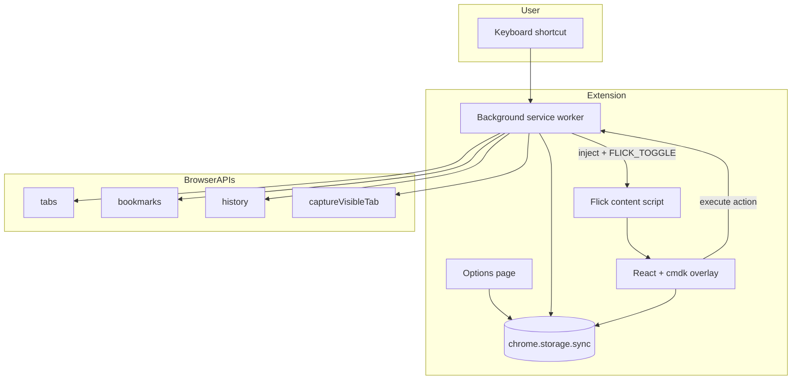

# Architecture

High-level design for Flick. This is the blueprint we implement against.

## Goals

1. **Instant** — Palette appears in <100ms after shortcut
2. **Keyboard-first** — No mouse required
3. **Isolated** — Overlay UI must not break or be broken by host pages
4. **Extensible** — New command types (aliases, utilities) plug in without rewiring core

## Non-goals (v1)

- System-wide Spotlight (macOS apps, files) — browser-only scope
- Cloud sync backend — `chrome.storage.sync` is enough for aliases
- AI/natural language commands

---

## Component diagram



---

## Entrypoints

| Entrypoint | Role |
|---|---|
| `background/` | Listens for `open-flick` command; injects content script if needed; runs actions that require extension APIs |
| `flick.content/` | Runtime-registered content script; mounts React overlay via `createIntegratedUi` |
| `options/` | Alias editor, shortcut reference, import/export |

No popup — the palette *is* the primary UI.

---

## Open flow

1. User presses **`⌘⇧K`** (Mac) or **`Ctrl+Shift+K`** (Windows/Linux)
2. `background` receives `chrome.commands.onCommand`
3. Query active tab
4. Try `tabs.sendMessage(tabId, { type: 'FLICK_TOGGLE' })`
5. If content script not loaded (restricted pages, first open):
   - `scripting.executeScript` with `/content-scripts/flick.js`
   - Retry message
6. Content script mounts integrated UI (shadow root)
7. Input focused; user types query
8. Results ranked and displayed
9. On select → action dispatched
10. On Escape / blur → `ui.remove()` unmounts overlay

### Restricted pages

Some URLs block content scripts (`chrome://`, Chrome Web Store, etc.). The palette cannot run there — show a brief notification or fallback to opening a dedicated extension tab.

---

## Search pipeline

```
User query
    │
    ▼
┌─────────────────────────────────────┐
│  Parallel providers (debounced 50ms) │
├─────────────────────────────────────┤
│  AliasProvider    → storage aliases  │
│  TabProvider      → tabs.query       │
│  BookmarkProvider → bookmarks.search │
│  HistoryProvider  → history.search   │
│  UtilityProvider  → static commands  │
│  RecentProvider   → storage recents  │
└─────────────────────────────────────┘
    │
    ▼
 Merge + dedupe by URL/tabId
    │
    ▼
 Fuse.js re-rank by query (if non-empty)
    │
    ▼
 CommandItem[] → cmdk list
```

Each provider returns `CommandItem[]`. Empty query shows **recents + utilities + top aliases**.

---

## Action execution

Actions are typed in `src/types/command.ts`:

```typescript
type CommandAction =
  | { type: 'navigate'; url: string; newTab?: boolean }
  | { type: 'switch-tab'; tabId: number }
  | { type: 'screenshot'; fullPage?: boolean }
  | { type: 'copy'; value: 'url' | 'title' }
  // ...
```

**Rule:** Content script sends action to background; background executes anything needing `tabs`, `bookmarks`, or `captureVisibleTab`. Simple navigations can use `window.location` from content script when already on a normal page — but centralizing in background keeps logic consistent.

---

## Messaging protocol

| Message | Direction | Payload |
|---|---|---|
| `FLICK_TOGGLE` | BG → CS | — |
| `FLICK_HIDE` | BG → CS | — |
| `EXECUTE_ACTION` | CS → BG | `{ action: CommandAction }` |
| `SEARCH_REQUEST` | CS → BG | `{ query: string }` (optional: heavy search in BG) |

For v1, search can run entirely in the content script (bookmarks/history APIs are available there). If we hit performance limits, move providers to background.

---

## Storage schema

```typescript
// chrome.storage.sync
{
  aliases: UrlAlias[];
  recents: { id: string; timestamp: number }[];
  settings: {
    openInNewTabDefault: boolean;
    maxRecents: number;
    theme: 'auto' | 'dark' | 'light';
  };
}
```

Seed aliases on `runtime.onInstalled` from `src/data/default-aliases.ts`.

---

## UI isolation

WXT's `createIntegratedUi` with `cssInjectionMode: 'ui'` mounts the palette in a **closed shadow root**. Tailwind styles are scoped to the shadow tree — host page CSS cannot leak in or out.

Z-index: `2147483647` (max practical) so overlay sits above page modals.

---

## Security considerations

- **No arbitrary code execution** from user aliases — URLs only, validated scheme (`https:`, `http:`, `chrome-extension:`)
- **Minimal permissions** — request `bookmarks`/`history` only when those providers ship
- **No remote code** — MV3 compliant; all logic bundled

---

## File layout (target)

```
src/
├── components/
│   ├── FlickShell.tsx          # Root overlay + cmdk
│   ├── CommandList.tsx
│   └── CommandItemRow.tsx
├── lib/
│   ├── search/
│   │   ├── fuse-config.ts
│   │   ├── merge-results.ts
│   │   └── providers/
│   │       ├── alias-provider.ts
│   │       ├── tab-provider.ts
│   │       └── ...
│   ├── actions/
│   │   └── execute-action.ts
│   └── storage/
│       └── aliases.ts
├── stores/
│   └── flick.store.ts
└── hooks/
    └── use-flick-search.ts
```
